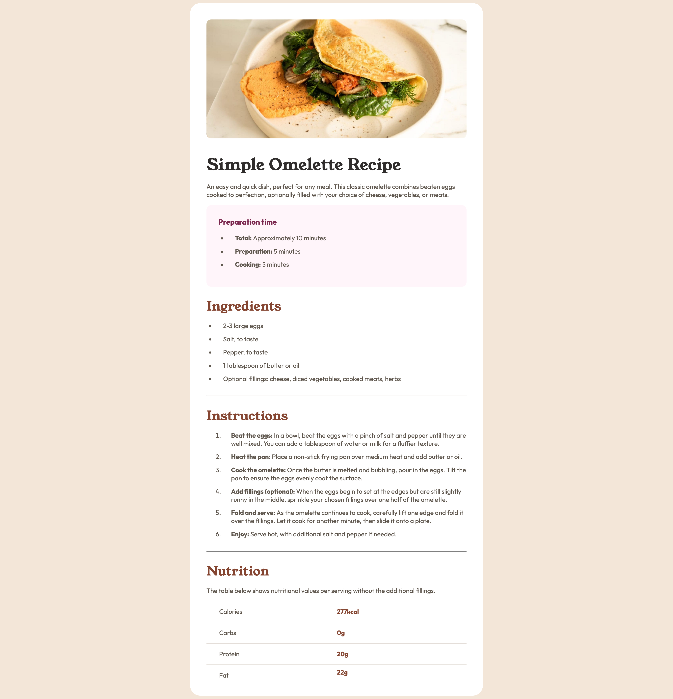

# Frontend Mentor - Recipe page solution

This is a solution to the [Recipe page challenge on Frontend Mentor](https://www.frontendmentor.io/challenges/recipe-page-KiTsR8QQKm). Frontend Mentor challenges help you improve your coding skills by building realistic projects. 

## Table of contents

- [Overview](#overview)
  - [The challenge](#the-challenge)
  - [Screenshot](#screenshot)
  - [Links](#links)
- [My process](#my-process)
  - [Built with](#built-with)
  - [What I learned](#what-i-learned)

**Note: Delete this note and update the table of contents based on what sections you keep.**

## Overview

### Screenshot



### Links

- [Solution URL](https://github.com/HaiDangN/recipe-page)
- [Live Site URL](https://haidangn.github.io/recipe-page/)

## My process

### Built with

- Semantic HTML5 markup
- CSS custom properties
- Flexbox

### What I learned

I learned what a viewport is and why setting the `min-height` of the `body` to the entire height of the viewport is useful.

```css
body {
    min-height: 100vh;
}
```

I learned how to make a table using the table tag in HTML!

```html
<table class="nutrition-table">
  <tr>
    <th>Calories</th>
    <td>277kcal</td>
  </tr>
  <tr>
    <th>Carbs</th>
    <td>0g</td>
  </tr>
  <tr>
    <th>Protein</th>
    <td>20g</td>
  </tr>
  <tr>
    <th>Fat</th>
    <td>22g</td>
  </tr>
</table>  
```

I learned the semantic importance of using sections instead of divs. Sections are used when you want to group thematically related content, whereas divs are fine when you just need to group for styling or layout

I learned that you should always use `box-sizing: border-box;`. It just makes the box model easier to work with and the reason why this isn't the default is because it would break older websites.

```css
body {
    box-sizing: border-box;
}
```

I learned what a `rem` is and why it's better than pixels for scalable design. It scales off of the user's root font size, making them better for accessibility.

I learned that you can assign properties to the last child of a table (or any parent element that contains multiple children).

I learned that you can effectively ignore the padding of a parent element using negative margin. This is done by offsetting the padding using